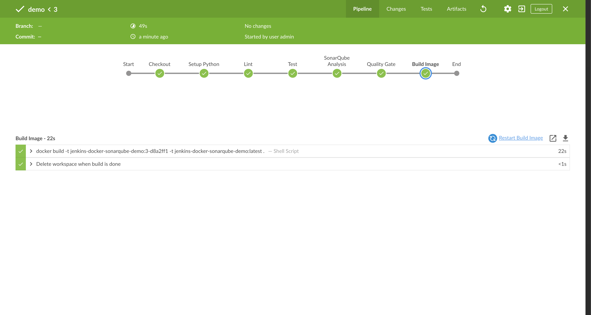
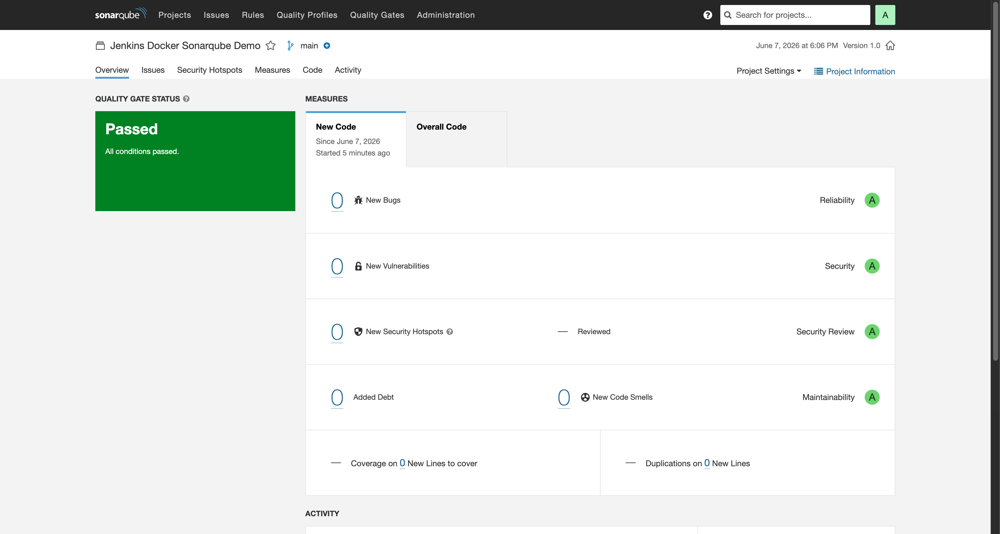
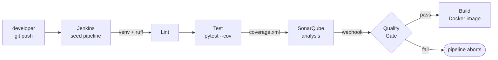

# Jenkins-Docker-Sonarqube

> Self-hosted Jenkins + SonarQube + Docker CI/CD demo with quality-gate enforcement,
> fully reproducible via `docker compose up -d`. No cloud accounts, no manual UI clicks.


## Demo

| Jenkins pipeline | SonarQube dashboard |
| :--: | :--: |
|  |  |

> Screenshots are captured during phase 5 of the rebuild against a fresh local stack.

## Flow



## What this shows

- **Jenkins Configuration as Code (JCasC).** Every Jenkins setting — admin user, Sonar
  server, Sonar Scanner CLI, the seed pipeline — lives in `jenkins/jenkins.yaml`.
  No clicking through the setup wizard, no manual job creation.
- **Pipeline as Code.** The pipeline lives in `Jenkinsfile`; the seed `demo` job in
  Jenkins points at this repo's Jenkinsfile via `cpsScm`.
- **SonarQube quality-gate enforcement.** `waitForQualityGate abortPipeline: true`
  blocks the build until SonarQube POSTs the gate result back via the webhook
  registered by the one-shot `bootstrap` container.
- **Reproducible Docker stack.** A single `docker compose up -d` brings up Postgres
  → SonarQube → Jenkins → bootstrap, with healthchecks + `depends_on:
  service_healthy` ordering and named volumes for persistence.

## Skills demonstrated

`Jenkins` `CI/CD` `SonarQube` `Code Quality` `Docker` `Docker Compose` `JCasC`
`Pipeline-as-Code` `Pydantic` `pytest` `ruff`

## Quick start

```bash
git clone https://github.com/NoobCoder1209/Jenkins-Docker-Sonarqube.git
cd Jenkins-Docker-Sonarqube
docker compose up -d --build      # ~3 min on first boot (Sonar + plugin install)
```

Wait until all services are healthy:

```bash
docker compose ps
# postgres, sonarqube, jenkins should all show (healthy);
# bootstrap will show Exited (0) once it has registered the webhook — that's expected.
docker compose logs bootstrap     # should show "webhook created" or "already exists"
```

Then:

| Service | URL | Default credentials (demo-only) |
| --- | --- | --- |
| Jenkins | <http://localhost:8080> | `admin` / `admin` |
| SonarQube | <http://localhost:9000> | `admin` / `admin` (Sonar forces a change on first login) |

## First-run workflow

The pipeline needs a SonarQube auth token to authenticate the scanner. The stack
ships with a placeholder (`changeme`); rotate it once after the first boot:

1. Open <http://localhost:9000>, log in `admin` / `admin`, change the password when
   prompted.
2. **My Account → Security → Generate Tokens.** Type=`User Token` (or
   `Project Analysis Token` scoped to `jenkins-docker-sonarqube`). Copy the token.
3. Drop them into a local `.env` (gitignored) at the repo root:
   ```bash
   cat > .env <<'EOF'
   SONARQUBE_TOKEN=squ_xxxxxxxxxxxxxxxxxxxxxxxxxx
   SONARQUBE_ADMIN_PASSWORD=<your-new-sonar-admin-password>
   EOF
   ```
   > **Important:** if you changed the Sonar admin password in step 1, you
   > **must** include `SONARQUBE_ADMIN_PASSWORD` in `.env`. Otherwise the
   > `bootstrap` container will 401 on its next run and exit early.
4. Make Jenkins pick up the new credential value by recreating the container:
   ```bash
   docker compose up -d --force-recreate jenkins
   ```
5. Open Jenkins → `demo` job → **Build Now**. The pipeline should run end-to-end:
   Checkout → Setup Python → Lint → Test → SonarQube Analysis → Quality Gate →
   Build Image.

## Demo-only security notes

This stack is shaped for a portfolio walkthrough on a single host. **Do not
reproduce any of these choices in a real environment:**

- The Jenkins container runs as `root` so it can reach the host Docker socket
  bind-mounted at `/var/run/docker.sock`. That effectively gives the container
  root on the host.
- Default Jenkins credentials are `admin` / `admin` (configured via JCasC's
  `${JENKINS_ADMIN_PASSWORD:-admin}` interpolation).
- Postgres uses `sonar` / `sonar`; SonarQube starts with `admin` / `admin`.
- The `bootstrap` container holds a hard-coded fallback admin password to
  register the webhook. Once you rotate the Sonar admin password (step 1 above)
  the bootstrap container's idempotency check downgrades to "skip" — the
  webhook lives in the `sonarqube_data` volume and survives across boots.

For real CI/CD: use Docker secrets (or a proper secret backend), a dedicated
Jenkins agent that does *not* mount the host socket, project-scoped Sonar tokens,
and rotated credentials.

## Repo layout

```
.
├── app/                      # Flask demo app (gets scanned)
│   ├── healthcheck.py
│   ├── main.py               # app factory + global JSON error handler
│   ├── models.py             # Pydantic input schemas
│   └── routes.py             # /, /health, /echo (Pydantic-validated), /info
├── tests/                    # pytest suite (~97% coverage)
├── jenkins/
│   ├── Dockerfile            # extends jenkins/jenkins:lts, adds Docker CLI + Python
│   ├── jenkins.yaml          # JCasC: admin, Sonar server, Sonar Scanner, seed job
│   └── plugins.txt           # 20 plugins, no version pins
├── scripts/
│   └── bootstrap-sonar-webhook.sh   # idempotent webhook registration
├── Dockerfile                # multi-stage app image (non-root uid 1001)
├── Jenkinsfile               # declarative pipeline
├── docker-compose.yml        # postgres + sonarqube + jenkins + bootstrap
├── sonar-project.properties  # Sonar project metadata (no host/token)
├── pyproject.toml            # ruff + pytest config
├── requirements.txt          # flask, pydantic
└── requirements-dev.txt      # pytest, pytest-cov, ruff
```

## Troubleshooting

**Pipeline hangs on "Quality Gate".**
The webhook from SonarQube to Jenkins isn't registered. Check
`docker compose logs bootstrap` — if it 401'd because you've rotated the Sonar
admin password, set `SONARQUBE_ADMIN_PASSWORD` in `.env` and re-run:
`docker compose run --rm bootstrap`.

**`SonarQube Analysis` stage fails with HTTP 401.**
The pipeline is using the placeholder `SONARQUBE_TOKEN=changeme`. Generate a real
token (see [First-run workflow](#first-run-workflow)) and `--force-recreate jenkins`.

**SonarQube container dies on Linux with "max virtual memory areas vm.max_map_count is too low".**
Either uncomment the `sysctls:` block in `docker-compose.yml`, or run on the host:
`sudo sysctl -w vm.max_map_count=524288`. Docker Desktop (macOS/Windows) handles
this in its embedded VM and needs no action.

**Ports `8080` / `9000` already in use.**
Edit the `ports:` mappings in `docker-compose.yml` to a free host port, e.g.
`"18080:8080"`. Update the SonarQube webhook URL in
`scripts/bootstrap-sonar-webhook.sh` if you also remap Jenkins.

**SonarQube takes forever to come up.**
First boot does Elasticsearch index initialisation; expect 60–120 s. Tail with
`docker compose logs -f sonarqube` and wait for `SonarQube is operational`.

**Reset everything and start fresh.**
`docker compose down -v` wipes the named volumes. `docker compose up -d --build`
rebuilds and re-bootstraps. You will need to rotate the Sonar token again.

## Verifying the quality-gate actually works

To confirm the gate enforces what it claims, push a deliberate violation on a
feature branch and watch the build go red. The intentional findings already in
`app/routes.py` (long function, unused local, debug `print`) are low-severity —
the default "Sonar way" gate ignores them.

The default **Sonar way** gate checks **new code only** and trips on any of:
new-code coverage `< 80%`, new-code duplicated lines `> 3%`, security hotspots
not 100% reviewed, or maintainability/reliability/security rating worse than A
on new code.

To trip it on purpose:

1. On a feature branch, add a **new** function in `app/routes.py` with no
   corresponding test (drops new-code coverage below 80%) **or** introduce an
   obvious security hotspot, e.g. `eval(request.args.get("x"))` in a new route.
2. Commit, push, trigger the `demo` job.
3. The `Quality Gate` stage will fail; the `Build Image` stage never runs.
4. Drop the demo branch (`git checkout main && git branch -D <branch>`) once
   you've seen the red build.

## License

[MIT](LICENSE).
